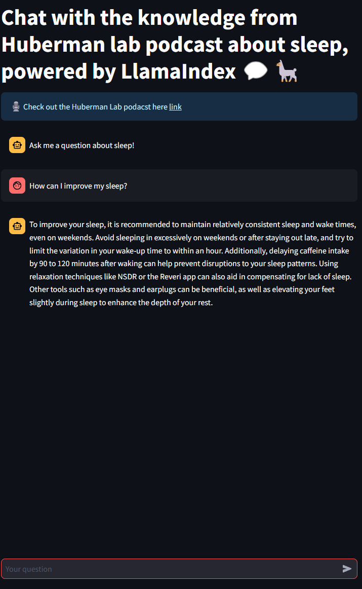

# StreamLitDemo

This repository showcases my ability to deploy a simple Streamlit application. The application utilizes Pinecone as a VectorDB store, which is accessed by LLamaIndex.

To run the script, simply execute the following command:
    
```bash
streamlit run bot.py
```


